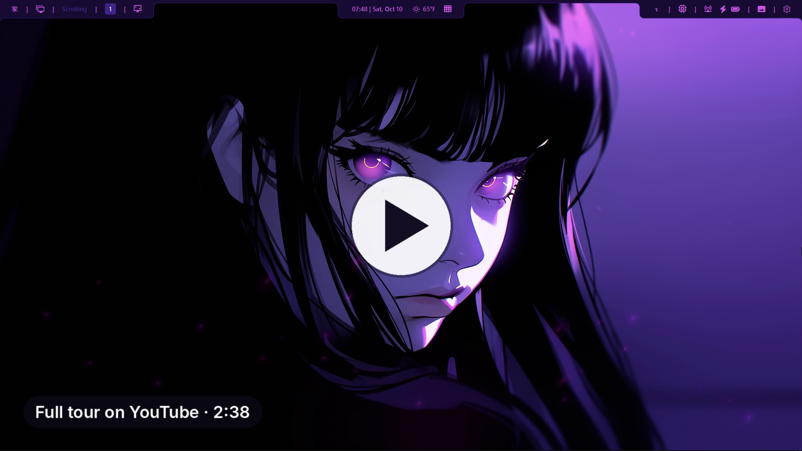
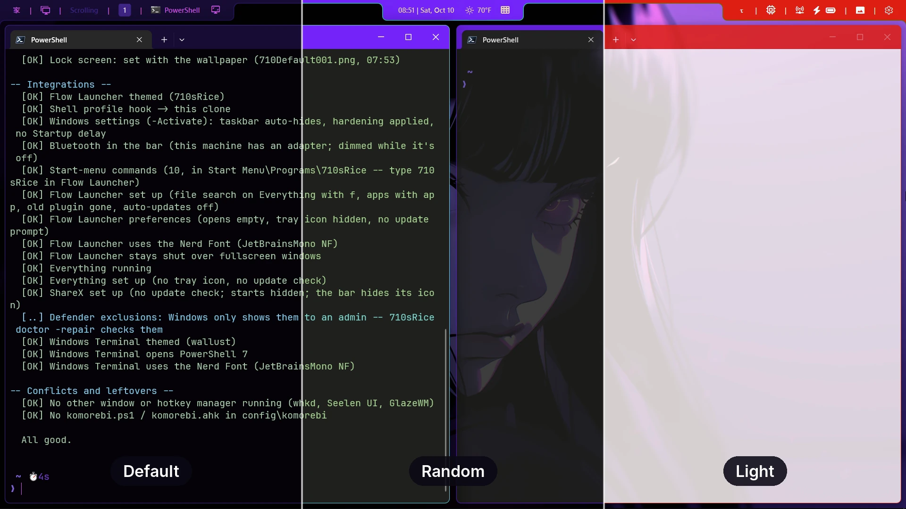
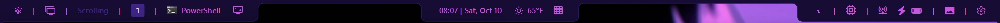
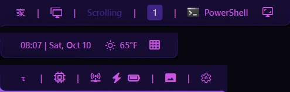
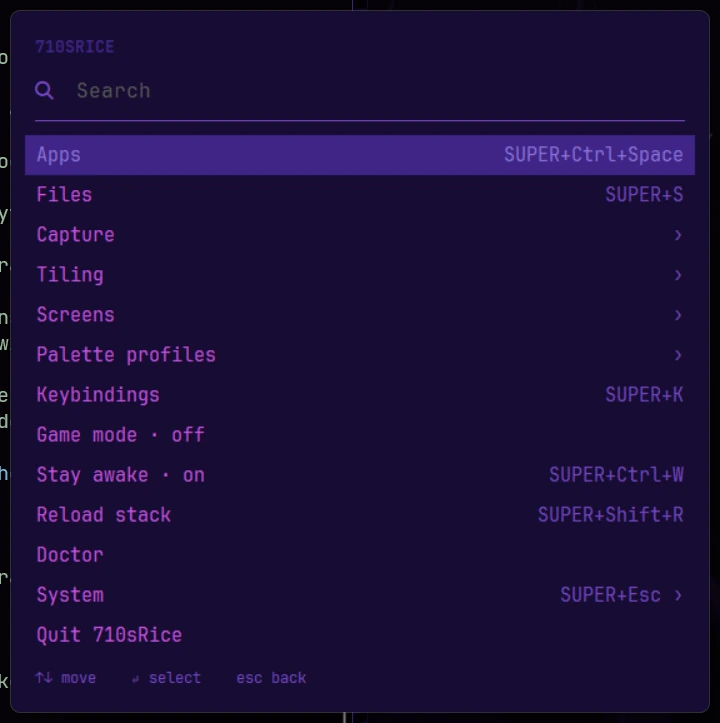
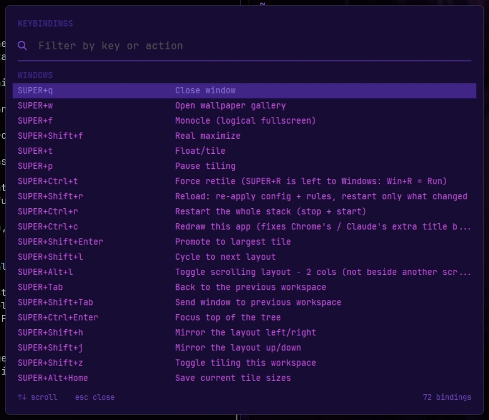

<h1> 710.DesktopRice</h1>

A keyboard-first tiling desktop for Windows 11, themed from your wallpaper.

**Installs in one line. Doctor names the fix when something breaks. Uninstall puts back what was there.**

**[Install](#install) · [Keys](#first-five-minutes) · [Manual](docs/README.md)**

https://github.com/user-attachments/assets/2cc17210-5323-44c0-bbde-60404939db0f

<a href="https://youtu.be/bE3JAw-zL8U"></a>

Hey, thanks for dropping by. I mod Skyrim sometimes, but my day job is in tech. At home I have an older laptop running [Niri](https://github.com/YaLTeR/niri) + [DankMaterialShell](https://github.com/AvengeMedia/DankMaterialShell), and I LOVE it. I wanted something like that on the Windows machines I daily drive, so I found ricing (komorebi, YASB, AutoHotkey, Flow Launcher), was pretty daunted by it all, and somehow found my way to [Winarchy](https://github.com/guidonaselli/winarchy).

But Winarchy was more than I wanted in some ways, and not quite enough in others. I considered forking it. In the end I decided it was better to take what I could learn from it and its author, Guido Naselli, and apply that. Along the way I discovered [wallust](https://codeberg.org/explosion-mental/wallust), a pywal alternative that runs on Windows, and fell in love with it. It takes Windows theming, and theming in general, to a whole new level. I tied everything to the wallpaper and thought I was done.

But I knew there was more. So the palette profile was born, and to me it's one of the things that set 710sRice apart. But enough about me and history. On to the rice.

## What you get

**Palette profiles.** Change the wallpaper with <kbd>SUPER</kbd>+<kbd>W</kbd> and everything
recolors to match: the bar, window borders, the Windows accent, Windows Terminal and the prompt,
the menus, Flow Launcher and the lock screen. A palette profile decides how those colors are made
and which goes where. Default ships with it; make up to ten of your own in the editor, from the
wallpaper, from about 600 built-in themes, or a random one each time.



**The bar.** Workspaces, the layout, the window title, the clock and weather, a taskbar drawer,
system info, Wi-Fi and Bluetooth, a capture drawer and the wallpaper gallery, in three islands
that take the theme's colors.



<p align="center"></p>

**The menus.** <kbd>SUPER</kbd>+<kbd>Alt</kbd>+<kbd>Space</kbd> opens the main menu (apps,
capture, tiling, screens, palette profiles, game mode, doctor); <kbd>SUPER</kbd>+<kbd>K</kbd>
lists every key. Every menu is searchable: start typing.

 

**Tiling.** komorebi tiles every window into a layout, stacks windows with tabs, and handles up
to four screens with nine workspaces each. Workspace 1 scrolls sideways, Niri-style: windows in
columns two wide.

**Doctor.** `710sRice doctor` checks the whole install and names the command that fixes each
thing it finds; `710sRice doctor -repair` runs them. On a healthy machine:

```text
== 710sRice doctor -- c52a460, 2026-10-10 ==
  [OK] Up to date with GitHub
  …
-- Stack --
  [OK] komorebi running
  [OK] YASB running
  [OK] 710.ahk running (UI Access)
  [OK] ShareX running
  [OK] Flow Launcher running

-- Tasks and tiling mode --
  [OK] Mode: full-time (starts at sign-in) -- 710sRice deactivate switches to on demand
  [OK] Tiling mode: elevated -- komorebi's task and the running komorebi agree
  …
  All good.
```

## Safe to try

- **It installs on demand.** Nothing starts at sign-in and Windows' own settings stay as they
  are until you run `710sRice activate`.
- **See it first.** `-DryRun` shows what `uninstall`, `activate` and `deactivate` would do, and
  changes nothing.
- **Uninstall puts back what was there,** not Windows' defaults: your wallpaper, lock screen,
  accent, Terminal, taskbar and settings, each saved before it first changed
  ([how](docs/under-the-hood.md#what-uninstall-puts-back)).
- **Pinned versions.** komorebi, YASB, AutoHotkey, Flow Launcher and Everything stay at the
  versions it was tested with ([versions.md](versions.md)).
- **Doctor names the fix,** and repair runs it.
- **No accounts, no keys.** Nothing to sign up for, the weather included.

**The price, plainly:**

- The one-liner runs a script from this repo's master branch, with one UAC prompt.
  [Read `boot.ps1`](boot.ps1) first if you like.
- Windows Defender exclusions for ShareX, Everything, `komorebic.exe`, PowerShell 7 and the repo
  (without them, captures and hotkeys lag while Defender scans).
- komorebi runs **elevated** so admin windows tile too, and it starts from files your account
  can change. On a shared or work-connected machine, `710sRice tiling normal` runs it as you
  instead ([the full trade-off](docs/tiling.md#admin-windows)).
- AutoHotkey runs with UI Access, so your keys reach admin windows without AutoHotkey being
  elevated.

How it's built: [Under the hood](docs/under-the-hood.md).

## Before you install

<details>
<summary><b>Windows 10? What's it tested on?</b></summary>

Windows 11 only. It's tested on Windows 11 Enterprise, 23H2 (build 22631) and 25H2 (build
26200).
</details>

<details>
<summary><b>Can I use it at work?</b></summary>

Not without a license: komorebi is free for personal use only, and using it for work needs a
commercial license from its author ([komorebi's licensing page](https://komorebi.lgug2z.com/about/licensing/)).
On a work-managed machine, komorebi says so itself with a pop-up.
</details>

<details>
<summary><b>I already run komorebi, YASB, GlazeWM, Seelen UI, PowerToys, my own AutoHotkey scripts or Winarchy. What happens to them?</b></summary>

- **komorebi, YASB, AutoHotkey, Flow Launcher:** the installer uses the copy you have (one older
  than its pin is moved up to it) and points komorebi and YASB at this repo's config through
  `KOMOREBI_CONFIG_HOME` and `YASB_CONFIG_HOME`. Your own config files stay on disk, unused.
  A plain uninstall removes these packages, yours included (`-Keep` keeps one), and takes the two
  variables off rather than putting back values you had set. Saving and restoring them is
  planned for a future update.
- **GlazeWM, Seelen UI, whkd:** two window or hotkey managers fight over the same windows and
  keys. Stop the other one and its autostart; `710sRice doctor` flags any of the three it finds
  running.
- **PowerToys:** not checked. Any of its shortcuts on <kbd>SUPER</kbd> can clash with 710's.
- **Your own AutoHotkey scripts:** keys they share with 710 clash. Move yours into
  [`user.ahk`](docs/customizing.md): it loads with 710's, and doctor names a key defined twice.
- **Winarchy:** uninstall it first. Both point komorebi and YASB at their own config.
</details>

<details>
<summary><b>I game and mod. What happens?</b></summary>

- Games are never tiled: the launchers and games it knows are in `games.toml`, and Quick add
  rule adds yours. Game mode shows in the main menu while one is focused.
- Workspace 9 of the first screen starts with tiling off, for apps with many windows of their
  own (Mod Organizer 2, Wabbajack).
- <kbd>SUPER</kbd>+<kbd>Q</kbd> closes the focused window, a game included.
- **AutoHotkey and anti-cheat:** there's no blanket answer. Anti-cheat vendors don't publish
  one, it varies by game, and AutoHotkey (with UI Access) runs the whole time 710sRice is up.
  710sRice only adds its own hotkeys; it doesn't automate games. If a game's rules worry you,
  run `710sRice stop` before you play.
</details>

<details>
<summary><b>What goes online?</b></summary>

- **The weather:** [Open-Meteo](https://open-meteo.com/), no account.
- **GitHub:** the one-liner and `git clone`; `710sRice doctor` asks which commit is newest;
  `710sRice update` pulls.
- **Installs and updates:** winget (and the Microsoft Store source for PowerShell 7), the
  PowerShell Gallery for two modules, and wallust's release on Codeberg (checksum-verified).
- **The apps' own update checks are off** (YASB's, Flow Launcher's, ShareX's, Everything's).
  Flow Launcher still fetches its plugin list each time it starts.
</details>

<details>
<summary><b>How many screens?</b></summary>

Up to four, each with workspaces 1–9. A fifth runs on komorebi's defaults. See
[Screens and workspaces](docs/desktop.md#screens-and-workspaces).
</details>

<details>
<summary><b>How do I undo it?</b></summary>

`710sRice uninstall -DryRun` shows the plan, `710sRice uninstall` does it. What it puts back,
keeps and removes: [Uninstall](docs/install.md#uninstall).
</details>

## Install

- Windows 11, with winget (built in).
- PowerShell 7 and git: the one-liner installs both if they're missing.
- Admin rights: install asks once, with a UAC prompt.

> [!IMPORTANT]
> Run it from a **normal** PowerShell window, not an admin one. Windows PowerShell is fine.

```powershell
irm https://raw.githubusercontent.com/ItsAlways710/710.DesktopRice/master/boot.ps1 | iex
```

| | What happens |
| --- | --- |
| 1 | git and PowerShell 7 are installed if they're missing |
| 2 | The repo is cloned to `C:\710.DesktopRice` (`$env:DESKTOPRICE_HOME` picks another place) |
| 3 | One UAC prompt; the installer runs in its own admin window |
| 4 | The packages install with winget, the pinned ones at their pins |
| 5 | The config goes in, and everything is themed from the default wallpaper |
| 6 | Open a new PowerShell 7 window: `710sRice start` starts it |

Three ways to run it, picked after the one-liner:

| Way | Then run | By hand, from the repo folder |
| --- | --- | --- |
| **On demand**: start and stop it when you like | nothing more | `.\710sRice.ps1 install` |
| **Full-time**: your desktop from sign-in | `710sRice activate` | `.\710sRice.ps1 install -Activate` |
| **Full-time, komorebi not elevated**: admin windows float | `710sRice tiling normal`, then `710sRice activate` | `.\710sRice.ps1 install -Activate -NoElevatedTiling` |

`710sRice activate` and `deactivate` switch between on demand and full-time at any time. The
details: [Install](docs/install.md).

<details>
<summary><b>By hand</b></summary>

Clone the repo wherever you like:

```powershell
git clone https://github.com/ItsAlways710/710.DesktopRice.git
```

Then, from a normal PowerShell 7 window in the repo folder, run one of the three commands above.
Install PowerShell 7 first if you don't have it
([Requirements](docs/install.md#requirements)).
</details>

> [!NOTE]
> Every install run puts the default wallpaper back. Pick yours again with <kbd>SUPER</kbd>+<kbd>W</kbd>.

> [!WARNING]
> komorebi is free for personal use only. Using it for work needs a commercial license from its
> author: [komorebi's licensing page](https://komorebi.lgug2z.com/about/licensing/).

## First five minutes

1. Click the weather widget on the bar, type your city and pick it.
2. <kbd>SUPER</kbd>+<kbd>W</kbd>: pick a wallpaper and watch everything recolor.
3. <kbd>SUPER</kbd>+<kbd>Space</kbd>: Flow Launcher, for apps and files.
4. <kbd>SUPER</kbd>+<kbd>Alt</kbd>+<kbd>Space</kbd>: the main menu. Try Palette profiles.
5. <kbd>SUPER</kbd>+<kbd>K</kbd>: every key, searchable.
6. `710sRice doctor` in a PowerShell 7 window: the health check.

The keys to know first (**SUPER** is the Windows key):

| Keys | What it does | Windows' own |
| --- | --- | --- |
| <kbd>SUPER</kbd>+<kbd>Enter</kbd> | Windows Terminal | |
| <kbd>SUPER</kbd>+<kbd>Space</kbd> | Flow Launcher | Switch keyboard language |
| <kbd>SUPER</kbd>+<kbd>Alt</kbd>+<kbd>Space</kbd> | Main menu | |
| <kbd>SUPER</kbd>+<kbd>K</kbd> | Every key, searchable | Cast |
| <kbd>SUPER</kbd>+<kbd>W</kbd> | Wallpaper gallery | Widgets |
| <kbd>SUPER</kbd>+<kbd>Q</kbd> | Close the window | Search |
| <kbd>SUPER</kbd>+<kbd>Esc</kbd> | Power menu: lock, sleep, restart, shut down | |
| <kbd>SUPER</kbd>+<kbd>Arrows</kbd> | Move focus | Snap the window |
| <kbd>SUPER</kbd>+<kbd>Shift</kbd>+<kbd>Arrows</kbd> | Move the window | Move it to another screen |
| <kbd>SUPER</kbd>+<kbd>1</kbd>…<kbd>9</kbd> | Go to workspace 1–9 | Open taskbar app 1–9 |
| <kbd>SUPER</kbd>+<kbd>Shift</kbd>+<kbd>1</kbd>…<kbd>9</kbd> | Move the window to workspace 1–9 | Another copy of taskbar app 1–9 |
| <kbd>SUPER</kbd>+<kbd>Shift</kbd>+<kbd>S</kbd> | Screenshot a region (ShareX) | Snipping Tool |

> [!TIP]
> <kbd>SUPER</kbd>+<kbd>K</kbd> lists every key, and the full tables are in
> [Keys and menus](docs/keys-and-menus.md).

## Make it yours

Four kinds of file are yours alone. Git ignores them, so neither `710sRice update` nor
`git pull` touches them: `config/ahk/user.ahk` (your own hotkeys), `config/pwsh/user.ps1` (your
PowerShell profile additions), `config/komorebi/rules.local.toml` (your app rules, games and
pins) and your palette profiles in `config/palettes`. What each one does, and how to fork it or
change what it installs: [Make it yours](docs/customizing.md).

## The 710sRice command

From any PowerShell 7 window. The ones that need admin rights ask with a UAC prompt.

```powershell
710sRice                    # the command list
710sRice start              # start it (stop stops it; restart does both)
710sRice doctor             # the health check: what's wrong, and the fix for each
710sRice doctor -repair     # run those fixes
710sRice update             # the newest version from GitHub, then repair
710sRice activate           # full-time from now on (deactivate: back to on demand)
710sRice palette use 3      # theme everything with palette profile 3
710sRice uninstall -DryRun  # what uninstall would do; changes nothing
710sRice uninstall          # put back what was there
```

- **Update** keeps your wallpaper, theme and choices (full-time or on demand, the tiling mode,
  your palette profiles, the screen numbers) and your own files. Updates are tested on real
  machines before they ship: [the history](https://github.com/ItsAlways710/710.DesktopRice/commits/master).
- **Uninstall** puts back what install changed, restores rather than resets, and leaves the
  repo and your own files.

Every command and the installer's steps: [The 710sRice command](docs/command.md).

## Troubleshooting

Start with `710sRice doctor` (or **Doctor** in the main menu). An `[XX]` is a problem that
`710sRice doctor -repair` fixes, unless doctor says it needs you; a `[!!]` is worth a look.

<details>
<summary><b>An app came back with an extra title bar after the bar restarted</b></summary>

Chromium-based apps (Chrome, the Claude desktop app) can come back drawing a row low. Focus the
app and press <kbd>SUPER</kbd>+<kbd>Ctrl</kbd>+<kbd>C</kbd>: it redraws in place. Keep it a
now-and-then key ([why](docs/troubleshooting.md#tips-and-known-issues)).
</details>

<details>
<summary><b>Terminal says JetBrainsMono NF is missing right after an install</b></summary>

Terminal reads the font list when it starts: close every Terminal window and open one again.
</details>

More: [Troubleshooting](docs/troubleshooting.md). Found a bug?
[Open an issue](https://github.com/ItsAlways710/710.DesktopRice/issues/new/choose); the form asks
for doctor's output.

## Credits and License

710.DesktopRice started life as a set of changes to
[Winarchy](https://github.com/guidonaselli/winarchy) by Guido Naselli, an Omarchy-inspired
Windows desktop, and much of its behavior is ported from it. The bar's look is the
[Okinami](https://github.com/amnweb/yasb-themes/tree/main/themes/b51c153d-397c-4be0-b7ed-4f619c6de87f)
theme from [yasb-themes](https://github.com/amnweb/yasb-themes), and the app rules that keep
komorebi from tiling things it shouldn't come from the community
[komorebi-application-specific-configuration](https://github.com/LGUG2Z/komorebi-application-specific-configuration).
Their licenses and copyright notices are in [THIRD_PARTY_NOTICES.md](THIRD_PARTY_NOTICES.md).

Inspired by [Niri](https://github.com/YaLTeR/niri), [DankMaterialShell](https://github.com/AvengeMedia/DankMaterialShell)
and Winarchy (and [Omarchy](https://github.com/basecamp/omarchy) behind it). Built on:

| Piece | What it does here |
| --- | --- |
| [komorebi](https://github.com/LGUG2Z/komorebi) | Tiling window manager: workspaces, layouts, borders. Admin windows tile too |
| [YASB](https://github.com/amnweb/yasb) | The bar across the top: workspaces, weather, system info, wallpaper gallery |
| [AutoHotkey v2](https://www.autohotkey.com/) | Every hotkey, plus the themed, searchable menus (`config/ahk/710.ahk` and its parts in `config/ahk/710/`) |
| [Flow Launcher](https://www.flowlauncher.com/) + [Everything](https://www.voidtools.com/) | App launcher and instant file search |
| [ShareX](https://getsharex.com/) | Screenshots, recordings, OCR, QR scanning |
| [Windows Terminal](https://github.com/microsoft/terminal) + PowerShell 7 | The terminal, with a [Starship](https://starship.rs/) prompt, fzf, zoxide, eza and bat |
| [wallust](https://codeberg.org/explosion-mental/wallust) | Pulls a color palette from the wallpaper; a [palette profile](docs/theming.md#palette-profiles) decides which color goes where |

This repo is [MIT](LICENSE). The tools it installs keep their own licenses, and one of them
matters: **komorebi is free for personal use only**. Using it for work needs a commercial
license from its author. See [komorebi's licensing page](https://komorebi.lgug2z.com/about/licensing/).
