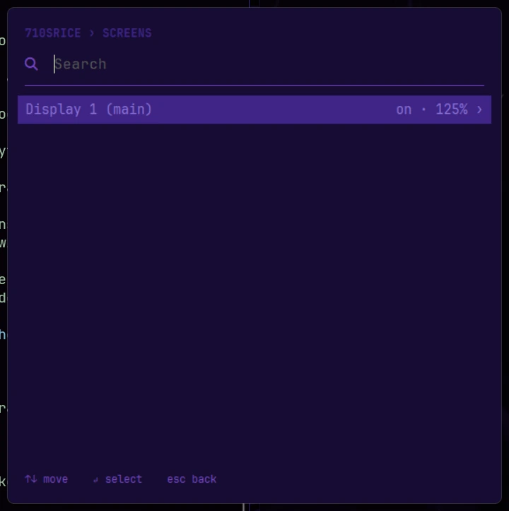

# Screens, workspaces and the bar

## Screens and workspaces

Up to four screens, each with workspaces 1–9. Workspace 1 of the first screen uses
komorebi's Scrolling layout, two columns wide (Columns while more than one screen is
connected: komorebi's own rule); the others use BSP.

SUPER+Alt+L switches the workspace you're on between Scrolling (two columns) and BSP, but not
to Scrolling on a screen with another screen to its left or right: komorebi would put the
windows that scroll off that screen on its neighbor, so a toast says why instead. A screen
above or below doesn't count. When your screens change (one turned on, plugged in or moved,
even while the stack was stopped), any workspace in Scrolling that now has a screen beside it
switches to Columns, with a toast and a line in `display-changes.log`. The bar's layout button
and SUPER+Shift+L (the next layout) are YASB's and komorebi's own and don't check: Scrolling
picked there stays until you change it, or your screens change.

Workspace 9 of the first screen starts with tiling off: windows stay where they open. It
suits apps with lots of windows of their own (Wabbajack, Mod Organizer 2), and it's the
place to check whether tiling is what bothers an app. SUPER+Shift+Z toggles tiling on the
workspace you're on. komorebi keeps that through SUPER+Ctrl+R; signing out, restarting
Windows or a config reload (adding or removing a rule or pin does one) puts tiling back
the way each workspace starts.

Each screen gets a number the first time 710sRice sees it, and keeps it: a screen you plug
in later takes the next free number, and one you unplug keeps its own for when it's back.
That's what a [pin](tiling.md#adding-a-rule) means by "screen 2". (Identical screens that report the
same serial number are told apart by how they're connected.) A fifth screen gets no number
and runs on komorebi's defaults (a single workspace); `710sRice doctor` mentions it.

When you plug a screen in or unplug one, komorebi doesn't always notice on its own: it looks
before Windows has finished rearranging the desktop. So a few seconds after every display
change, 710.ahk asks it to look again (`display-changes.log` has a line for each time). An
unplugged screen's workspaces and windows wait for it, and come back with it, pins included.

## The bar

- **Screens:** the monitor icon after the home menu drops down a list of your screens, each by its
  Windows name with the main one marked, showing whether it's on and at what scale. Pick one to
  turn it off or back on, or to change its scale (the steps Windows allows it). Off, the other
  screens stay exactly where they are; back on, Windows puts it where it was with that set of
  screens, so placement stays in Settings > Display (a set Windows has never seen gets its
  default placement once: arrange it there and Windows keeps it). The main display always stays
  on. Turning off a screen where komorebi still has windows, on any of its workspaces, lists them
  and asks first: **Cancel** (the default) lets you move them, **Turn it off anyway** doesn't
  wait; a screen with none turns off straight away. Any scale change, from here or from Settings,
  restarts the bar a few seconds later, so the space it keeps at the top matches its new size.
  It's also in SUPER+Alt+Space under **Screens**. It uses the DisplayConfig module (installed
  with the other packages), so it works with whatever screens a machine has.

  

- **Workspaces:** each screen's bar shows the workspace it's on and the ones with windows in
  them; empty ones appear while you're on them.
- **Weather:** click the widget, type your city (two letters are enough to start), and pick
  it. That's once, for every screen's bar; click the city name on the weather card to pick
  another. It uses [Open-Meteo](https://open-meteo.com/): no account, no key. It shows
  **°F**; for °C, open `config/yasb/config.yaml`, find the `weather:` widget and change
  `units: "imperial"` to `units: "metric"`.
- **Taskbar drawer:** the grid icon after the weather unfolds your apps: pins first, then
  what's running on that screen's current workspace, one button per app (with a count when it
  has more than one window) and a line under each one that's running. Hover a button for its
  name; click to switch to it, click the focused one to minimize it. Right-click an app for its
  menu: **Pin to taskbar** keeps it there for launching. Pins are per machine and show on every
  screen's bar; YASB keeps them in `%LOCALAPPDATA%\YASB`, outside this repo, so nothing ships
  pinned. The arrow folds the drawer again.
- **Network:** Wi-Fi and Bluetooth sit together on the right, folded behind their button (the
  network icon; click it to unfold, the arrow folds them again). Wi-Fi: click for the networks
  around you, right-click for the one you're on (on a cable it shows the Ethernet icon, and
  right-click gives the IP address). Bluetooth: click for your devices and its on/off switch;
  it's dimmed while Bluetooth is off, and a machine with no Bluetooth adapter doesn't show it
  at all. Middle-click either one for its page in Windows Settings.
- **Battery:** next to them, on a machine that has one. Click it for the percentage.
- **Capture drawer:** the screenshot icon after the window title (a screen with a capture frame)
  unfolds six ShareX buttons (region, screen recording, stop recording, text from screen, scan a
  QR code, color picker); the arrow folds them again. Hover a button for its name.
- **Tray:** ShareX's icon is hidden here and Everything has none (see
  [What install always does](install.md#what-install-always-does)). YASB's own tray icon is off too;
  `710sRice restart` (SUPER+Ctrl+R) restarts the bar.
