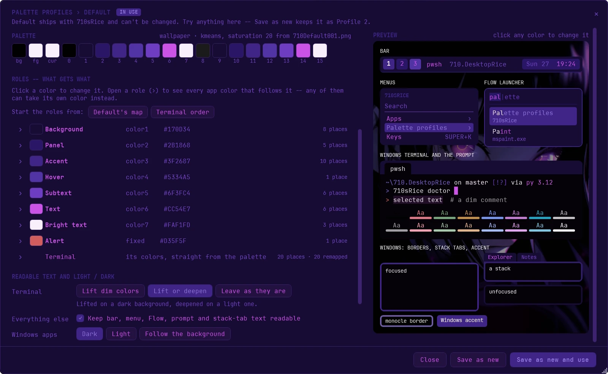

# Wallpapers and theming

Change the wallpaper with **SUPER+W** (or the wallpaper button on the bar) and everything
recolors to match: the bar, komorebi's window borders and stack tabs, the Windows accent
color, Windows Terminal, the prompt, the menus, Flow Launcher and the lock screen. wallust
does the color picking; the [palette profile](#palette-profiles) in use decides how, and
which color goes where.

The lock screen takes the wallpaper itself, as your own lock-screen picture (the one
Settings > Personalization > Lock screen sets), so it's there before sign-in straight away,
even after a restart. Windows only shows that picture while its lock-screen choice is
**Picture** (Windows Spotlight or a slideshow hide it), so every wallpaper change sets that
too; uninstall puts your own choice back. The screens before sign-in (the clock and password
screens at boot) read Windows' own copy of that choice, so every wallpaper change sets that
copy too; doctor says when it's out of step, and uninstall puts it back as well. A picture you
pick in Settings stays until your next wallpaper change.

The gallery shows:

- `assets/wallpapers` in this repo, the wallpapers that ship with it.
- Up to ten folders of your own (subfolders included), one per variable:
  `YASB_WALLPAPER_PATH`, then `YASB_WALLPAPER_PATH_2` through `YASB_WALLPAPER_PATH_10`.
  None is set by default, and an unset one is simply skipped. To add a folder:

  ```powershell
  setx YASB_WALLPAPER_PATH "C:\Users\<you>\Pictures\Wallpapers"
  ```

  ```powershell
  setx YASB_WALLPAPER_PATH_2 "C:\Windows\Web\Wallpaper"
  ```

  (that second one is a good start: Windows' own wallpapers, on every Windows 11 machine),
  then restart the bar so it sees the change: `710sRice reload bar`. To drop one again:

  ```powershell
  [Environment]::SetEnvironmentVariable('YASB_WALLPAPER_PATH_2', $null, 'User')
  ```

  (then `710sRice reload bar` again). No need to edit `config/yasb/config.yaml`.

## Palette profiles

The wallpaper decides the colors; a palette profile decides how they're made and where each
one goes. **Default** is the theme described above, and it's in use until you pick another:
wallust's `kmeans` with a little more saturation for the bar, menus, Flow, borders and accent, while
Windows Terminal keeps fixed red, green, yellow, blue, purple and cyan, tinted by the wallpaper,
so text stays distinct and readable on any wallpaper. Up to ten profiles of your own sit beside
it, and the one in use applies to every wallpaper. The Default before 2026-09-28 (every Terminal
color straight from the wallpaper) is kept in `config/palettes/archive`, with how to use it
again.

**SUPER+Alt+Space > Palette profiles**:

- **Choose profile** re-themes everything with that profile at once, without changing the
  wallpaper, and every wallpaper change after that uses it too. It stays chosen through
  sign-out and `710sRice update`.
- **Create profile** and **Edit profile** open the editor.

The editor has:


- **Color source**: how the palette is made. From the wallpaper (wallust's `kmeans`,
  Default's, or `salience` or `ansi`; a dark or light palette; more saturation; 16 distinct
  colors), the built-in theme closest to each wallpaper, one built-in theme (about 600,
  searchable), a random built-in theme each time, or a color scheme file (pywal or
  terminal.sexy) that you put in `config/palettes/schemes`.
- **Palette**: the colors that source makes from the wallpaper you have now.
- **Roles**: eight named colors (Background, Panel, Accent, Hover, Subtext, Text, Bright text,
  Alert), each taken from the palette. Open a role to see every app color that follows it;
  any of them can have a color of its own instead. Built-in themes and scheme files come in
  terminal order, so the **Terminal order** button suits them better than Default's map.
- **Readable text** (colors too dim to read get lifted), **light or dark** Windows apps, and
  which apps the profile themes at all. An app that's switched off keeps its own colors.
- **Preview**: the bar, the menus, Flow Launcher, Terminal and the prompt, window borders,
  stack tabs and the Windows accent, in the profile's colors on your wallpaper. Click any
  color in it to change it.




Picking a color gives you a palette color, a role, or a fixed color (the same on every
wallpaper), as it is, lighter, darker, or mixed with another. **Save** keeps the profile;
**Save and use** also themes everything with it now. Default can't be changed, but you can
try anything on it and **Save as new**.

From a PowerShell 7 window, `710sRice palette` lists the profiles, `710sRice palette use 3`
(or its name) switches, and `710sRice palette edit` / `710sRice palette new` open the editor.

If wallust can't make a palette from a wallpaper, nothing is left half-themed: the last theme
stays and a notification says why. `710sRice doctor` checks that the colors on screen are the
ones the profile in use makes, and names the fix when they aren't.

Theming another app takes one small file; `tools/palette/targets/README.md` explains how,
with Flow Launcher as the example.

---

[← The manual](README.md) · Next: [Tiling: app rules and admin windows](tiling.md)
