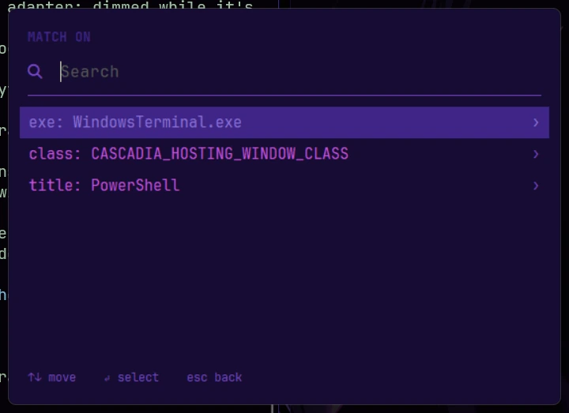
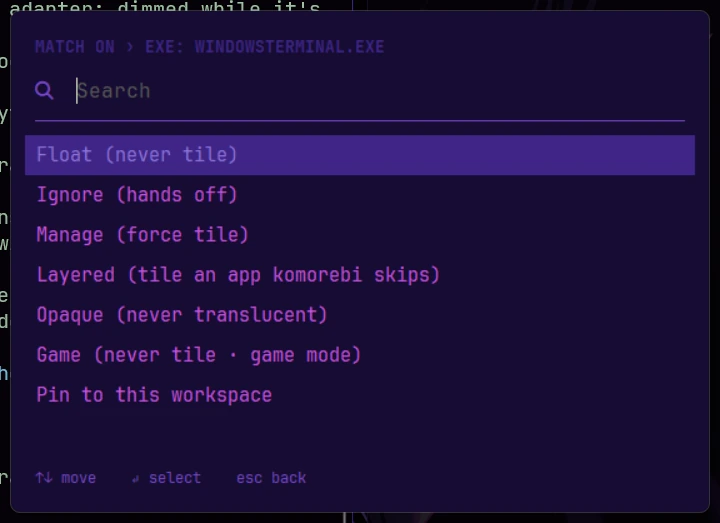

# Tiling: app rules and admin windows

## App rules

Rules decide which windows komorebi tiles, floats or leaves alone. They come in four
layers, lowest to highest priority, and SUPER+Shift+R compiles them into komorebi's config:

1. The community rules in `vendor/asc` (a pinned copy, updated deliberately).
2. `games.toml`: the game launchers and games this repo knows, so they're never tiled. Game
   mode (in the main menu) shows while one is focused. Add your own with Quick add's Game
   (below); they go in your file, layer 4.
3. `config/komorebi/rules.toml`: the rules this repo ships, tracked in git. Currently three:
   WinUI 3 apps (the new Photos app and others) stay opaque when unfocused, because
   komorebi's transparency stops them taking clicks (transparency is off by default;
   SUPER+Shift+D turns it on); the Claude desktop app is tiled
   (see [Tips and known issues](troubleshooting.md#tips-and-known-issues)); and komorebi leaves Flow Launcher
   and ShareX alone, so ShareX's editor and settings, and Flow's settings window, open as
   ordinary windows instead of being tiled.
4. `config/komorebi/rules.local.toml`: **your** rules, for this machine only (git ignores
   it), your games and your pins included. They win over everything above. Want a rule on
   every machine? Move it into `rules.toml` (a game into `games.toml`) and commit it. Pins
   stay here: they name this machine's screens.

One limit: for the "extra behavior" rule types (Layered, Opaque and a few others), every
layer's rules are added together, so your file can add them but can't cancel a shipped
one. Edit `rules.toml` for that.

### Adding a rule

**SUPER+Alt+Space → Tiling → Quick add rule...**, click the window, pick what to match on
(its program, window class or title), then what to do with it:

| Action | What it does | Takes effect |
| --- | --- | --- |
| Float (never tile) | komorebi manages it but never tiles it | Right away, on that window too |
| Ignore (hands off) | komorebi leaves it completely alone | Right away |
| Manage (force tile) | Tiles a window komorebi would normally skip | Right away |
| Layered (tile an app komorebi skips) | For apps whose windows komorebi turns away because of how they're drawn, like the Claude desktop app | New windows: **relaunch the app** |
| Opaque (never translucent) | Keeps it solid when unfocused, for apps that stop taking clicks when translucent. Only matters with transparency on (off by default; SUPER+Shift+D) | The next time you click it |
| Game (never tile · game mode) | A game of your own: never tiled, and Game mode shows while it's focused | Right away |
| Pin to this workspace | The app's windows open on the screen and workspace the window you picked is on now | Windows that open from now on |

Game and Pin are offered when you match on the program (exe). If the window you picked
looks like a Layered case (komorebi isn't managing it and it has the telltale window
style), Layered moves to the top, marked **suggested**. Rules for windows running as
administrator work too.

About pins:

- **One pin per app.** Pinning it again from somewhere else moves the pin there.
- **Where it opens, not where it stays.** A pinned window opens on its workspace, and you can
  move it anywhere after that. A window that's already open when you pin stays where it is.
  When komorebi restarts (`710sRice restart`, SUPER+Ctrl+R, or a rule removed), an open
  pinned window goes back to its workspace once.
- **Not for every window.** Quick add says why it won't pin: a window komorebi doesn't
  manage, Windows Terminal or File Explorer (one program runs every window of theirs, so all
  of them would follow), a game, or a screen without a number yet (`710sRice doctor` says
  how to fix that).
- Menus show a pin as `chrome.exe → screen 2, workspace 3`. In `rules.local.toml` it's a
  `[[pin]]` block with `exe = "chrome.exe"`, `screen = 2` and `workspace = 3`; a game is a
  `[[game]]` block with its `exe`.

### Removing and editing rules

- **Tiling → Remove a rule...** lists your rules, games and pins; pick one and confirm.
  komorebi restarts to drop a rule or a game. Windows that were already open keep the state
  komorebi remembered for them (a window you un-floated stays floating, for example) until you
  press **SUPER+T** on it or relaunch the app. A pin goes without a restart.
- **Tiling → Edit my rules...** opens `rules.local.toml` in whatever opens `.toml` files, or
  Notepad. Save, then SUPER+Shift+R to apply.

Only your own rules are listed and removable here; the shipped ones are edited in
`rules.toml` like any other config.

## Admin windows

By default komorebi runs **elevated** (as administrator), so windows running as
administrator tile, move and resize like everything else. Your hotkeys work in them too:
AutoHotkey runs with UI Access, which lets it send keys to admin windows **without** being
elevated itself, so nothing it launches runs as admin by accident.

- **SUPER+Alt+Enter** opens a Windows Terminal as administrator (after a UAC prompt), tiled
  on the monitor under the mouse.
- **Opting out:** `710sRice tiling normal` runs komorebi as you instead; admin windows then
  float and can't be tiled. `710sRice tiling elevated` switches back, and
  `710sRice tiling status` shows where things stand. The choice is remembered (a re-run of
  install keeps it), it doesn't touch your wallpaper or theme, and it takes effect the next
  time komorebi starts (sign out and in, or `710sRice restart`).
- **Admin commands without an admin window:** turn on Windows 11's `sudo` (Settings >
  System > For developers > Enable sudo, "Inline" mode) and run `sudo <command>` in a normal
  Terminal.

**The trade-off, plainly:** an elevated komorebi starts from files your normal account can
change (its startup script, its config folder, an environment variable). So any program
already running as you could use them to get admin rights without a UAC prompt. On a
personal machine where you're the only user that's a small step, since UAC isn't a
security boundary to begin with, but on a shared or work-connected machine use
`710sRice tiling normal`. komorebi's author also describes running it elevated as "not well
tested", so if something odd shows up around admin windows, that's the first thing to try.

---

[← The manual](README.md) · Next: [Make it yours](customizing.md)
